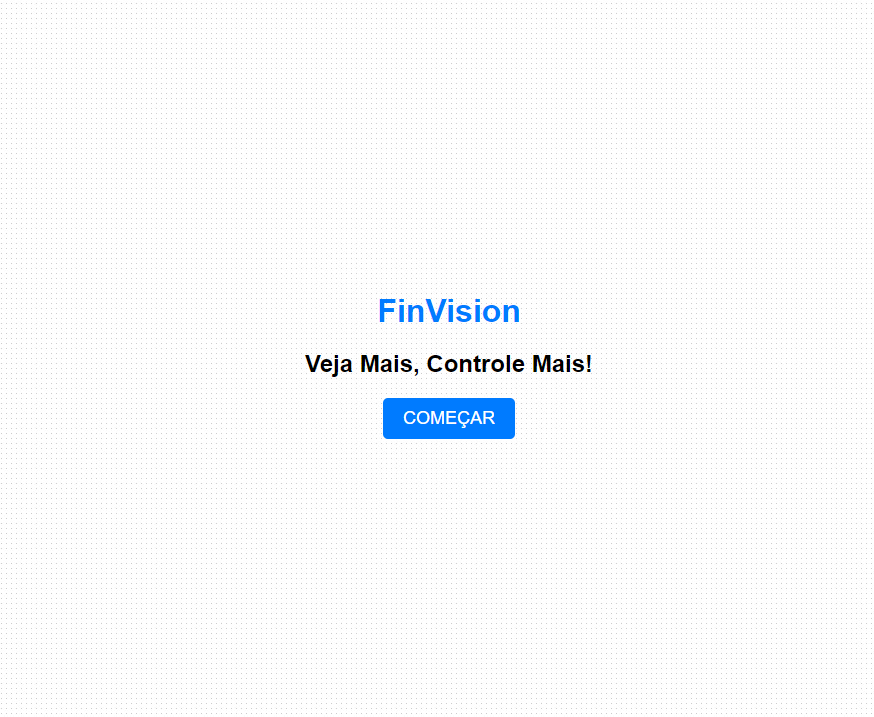
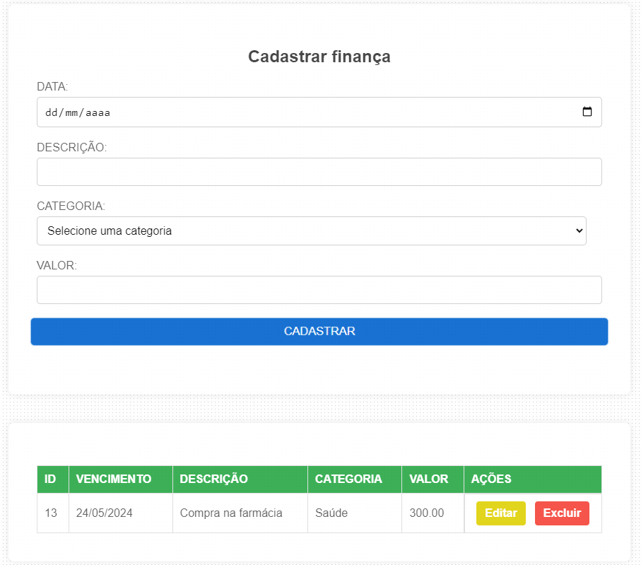
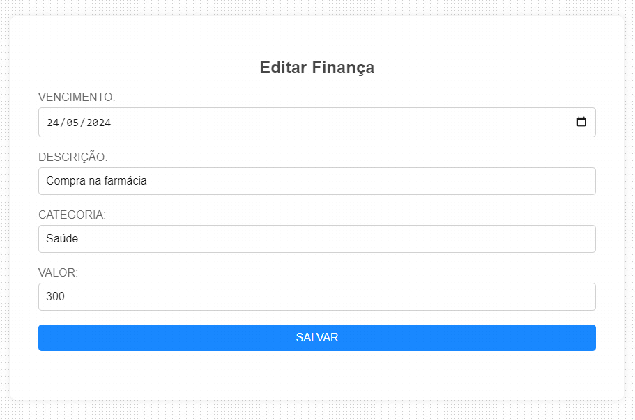

# APP FINVISION

### Descrição:
Este é um projeto frontend desenvolvido com HTML, CSS e JavaScript, criado com o objetivo de fornecer uma interface amigável e responsiva para o controle de finanças. Através desse App, os usuários poderão inserir, editar e excluir suas finanças pessoais e salvar os dados em um servidor por meio de uma conexão com uma API REST.

### Recursos e Funcionalidades:
- Listar Finanças (automático).
- Criar Finanças.
- Editar Finanças.
- Excluir Finanças.

### Tela Inicial:

### Tela de cadastro e lista de finanças:

### Tela para editar finança:

### Tecnologias utilizadas:
- HTML5
- CSS3
- Javascript
- GIT e Github
- MockAPI

### Requisitos de Instalação:
1. Clone este repositório em sua máquina local.
2. Abra o arquivo `index.html` em seu navegador web para acessar a tela inicial.
3. Para que os métodos CRUD funcionem, necessário utilizar algum mock de API ou baixe e configure a API deste projeto clicando <a href="https://github.com/jonathandscoutinho/finVision_back-spti" target="_blank">Aqui!</a>

### Contribuição:
Se você deseja contribuir para este projeto, sinta-se à vontade para fazer fork deste repositório, realizar melhorias ou correções e enviar um pull request. Toda contribuição é bem-vinda!

### Contato:

 
 
  
    
  

